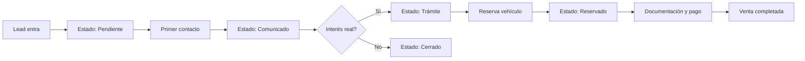

# MidCar Backoffice - Walkthrough Completo

## Índice
1. [Introducción](#1-introducción)
2. [Requisitos Previos](#2-requisitos-previos)
3. [Estructura del Proyecto](#3-estructura-del-proyecto)
4. [Guía de Usuario](#4-guía-de-usuario)
5. [Flujos de Trabajo](#5-flujos-de-trabajo)
6. [Componentes Implementados](#6-componentes-implementados)
7. [API y Datos](#7-api-y-datos)
8. [Personalización](#8-personalización)
9. [Troubleshooting](#9-troubleshooting)
10. [Changelog](#10-changelog)

---

## 1. Introducción

### Descripción General
**MidCar Backoffice** es un sistema de gestión integral para concesionarios de vehículos de segunda mano. Proporciona herramientas completas para la gestión de contactos/leads, inventario de vehículos, facturación y seguimiento comercial.

### Propósito y Funcionalidades Principales
- 📇 **Gestión de Contactos**: CRM completo con seguimiento de leads y estados
- 🚗 **Inventario de Vehículos**: Fichas técnicas detalladas, equipamiento y documentación
- 💰 **Panel Financiero**: Control de márgenes, precios y reservas
- 📊 **Dashboard**: KPIs y métricas de rendimiento

### Stack Tecnológico
| Tecnología | Versión | Uso |
|------------|---------|-----|
| Next.js | 14.2.18 | Framework React SSR/SSG |
| TypeScript | 5.x | Tipado estático |
| Tailwind CSS | 3.x | Estilos utility-first |
| shadcn/ui | Latest | Componentes UI |
| Lucide React | Latest | Iconografía |

---

## 2. Requisitos Previos

### Dependencias del Sistema
- Node.js 18.x o superior
- npm 9.x o superior

### Instalación
```bash
# Clonar repositorio
git clone [repo-url]
cd MidCar

# Instalar dependencias
npm install

# Ejecutar en desarrollo
npm run dev
```

### Variables de Entorno
Crear archivo `.env` basado en `.env.example`:
```env
# Supabase (si aplica)
NEXT_PUBLIC_SUPABASE_URL=your_supabase_url
NEXT_PUBLIC_SUPABASE_ANON_KEY=your_anon_key
```

---

## 3. Estructura del Proyecto

```
MidCar/
├── src/
│   ├── app/                          # App Router de Next.js
│   │   ├── (dashboard)/              # Rutas del dashboard
│   │   │   ├── contactos/page.tsx    # Página de contactos
│   │   │   ├── crm/page.tsx          # Página CRM
│   │   │   ├── inventario/           # Inventario de vehículos
│   │   │   │   ├── page.tsx          # Lista de vehículos
│   │   │   │   ├── [id]/page.tsx     # Detalle de vehículo
│   │   │   └── nuevo/page.tsx    # Nuevo vehículo
│   │   │   ├── dashboard/page.tsx    # Dashboard principal
│   │   │   ├── reportes/page.tsx     # Reportes
│   │   │   ├── seguro/page.tsx       # Control de seguros
│   │   │   └── configuracion/page.tsx# Configuración
│   │   ├── globals.css               # Estilos globales
│   │   └── layout.tsx                # Layout raíz
│   │
│   ├── components/
│   │   ├── contacts/                 # Componentes de contactos
│   │   │   ├── ContactDetailModal.tsx# Modal detalle contacto
│   │   │   ├── NewContactModal.tsx   # Modal nuevo contacto
│   │   │   └── VehicleSelector.tsx   # Selector de vehículos
│   │   ├── crm/                      # Componentes CRM
│   │   │   └── LeadDetailModal.tsx   # Modal detalle lead
│   │   ├── inventory/                # Componentes inventario
│   │   │   ├── VehicleCard.tsx       # Tarjeta de vehículo
│   │   │   ├── VehicleTable.tsx      # Tabla de vehículos
│   │   │   ├── VehicleActions.tsx    # Acciones de vehículo
│   │   │   ├── PrintableAd.tsx       # Anuncio imprimible
│   │   │   └── WebLinkModal.tsx      # Modal enlace web
│   │   ├── layout/
│   │   │   └── Header.tsx            # Cabecera/navegación
│   │   ├── dashboard/                # Componentes dashboard
│   │   │   ├── KPICard.tsx           # Tarjeta KPI
│   │   │   ├── Charts.tsx            # Gráficos
│   │   │   └── Gauge.tsx             # Indicadores gauge
│   │   └── ui/                       # Componentes shadcn/ui
│   │       ├── button.tsx
│   │       ├── card.tsx
│   │       ├── dialog.tsx
│   │       ├── table.tsx
│   │       └── ...                   # 18 componentes UI
│   │
│   ├── lib/
│   │   ├── constants.ts              # Constantes del sistema
│   │   ├── mock-data.ts              # Datos de prueba
│   │   └── utils.ts                  # Utilidades
│   │
│   └── types/
│       └── index.ts                  # Definiciones TypeScript
│
├── package.json
├── tailwind.config.ts
└── tsconfig.json
```

---

## 4. Guía de Usuario

### 4.1 Dashboard Principal
**Ruta**: `/dashboard`

- **KPIs principales**: Ventas del mes, leads activos, vehículos en stock
- **Gráficos**: Tendencias de ventas, distribución por marca
- **Notificaciones**: Alertas de vehículos +60 días, nuevos leads

### 4.2 Gestión de Contactos
**Ruta**: `/contactos`

#### Ver Lista de Contactos
La tabla muestra las siguientes columnas:
| Columna | Descripción |
|---------|-------------|
| Coche | Vehículo de interés |
| Cliente nombre | Nombre completo |
| Cliente teléfono | Número de contacto |
| Correo electrónico | Email del cliente |
| Progreso | Barra visual 0-100% |
| Fecha último contacto | Última interacción |
| Estado | Badge con color |
| Categoría | Tipo de consulta |
| Asunto | Motivo del contacto |

#### Filtrar por Estado
Botones de filtro con contadores:
- 🟠 **Pendiente**: Leads sin contactar
- ⚪ **Comunicado**: Ya contactados
- 🟡 **Trámite**: En proceso
- 🔵 **Reservado**: Con reserva
- 🟢 **Postventa**: Clientes anteriores
- 🔷 **Búsqueda**: Buscando vehículo específico
- 🔴 **Cerrado**: Finalizados

#### Buscar Contactos
Campo de búsqueda que filtra por:
- Nombre y apellidos
- Teléfono
- Email

### 4.3 Ficha de Contacto
**Modal**: `ContactDetailModal`

#### Panel Izquierdo - Vehículos
- Lista de coches asociados al contacto
- Click para seleccionar y ver detalles
- Botón "Añadir" para asociar más vehículos

#### Panel Central - Información
- **Avatar/Imagen**: Foto del vehículo seleccionado
- **Datos editables**:
  - Nombre y Apellidos
  - Teléfono
  - Tipo de pago (Contado/Financiación/Renting)
  - Transporte (€)
  - Checkbox "Nuevo cliente"
- **Sección Resumen**:
  - Fecha de contacto
  - Comercial asignado
  - Canal de origen
- **Campo de Notas**: Área de texto para anotaciones

#### Panel Derecho - Información Financiera
- Coche seleccionado
- Precio (€)
- Reserva (€)
- **Total pago** (calculado automáticamente)
- Selector de Estado

#### Barra de Acciones
| Acción | Icono | Función |
|--------|-------|---------|
| Nueva interacción | 💬 | Registrar contacto |
| Prioridad | ⭐ | Marcar como prioritario |
| Aplazar | ⏰ | Posponer seguimiento |
| Asignar comercial | 👤 | Reasignar vendedor |
| Añadir tarea | ☑️ | Crear recordatorio |
| Proforma | 📄 | Generar proforma |
| Señal | 🔖 | Registrar reserva |
| Contrato | ✍️ | Preparar contrato |
| Factura | 🧾 | Generar factura |

### 4.4 Gestión de Vehículos
**Ruta**: `/inventario`

#### Vista de Inventario
- **Grid view**: Tarjetas con imagen, precio, specs
- **Table view**: Lista detallada
- **Filtros**: Por marca, combustible, estado
- **Ordenación**: Por precio, fecha, días en stock

#### Ficha Técnica del Vehículo
**Ruta**: `/inventario/[id]`

##### Pestañas Disponibles
1. **General**: Identificación, carrocería, historial
2. **Técnico**: Motor, transmisión, consumo/emisiones
3. **Equipamiento**: Seguridad, confort, tecnología, iluminación
4. **Historial**: Timeline de eventos (entrada stock, reparaciones)
5. **Documentos**: Permisos, fichas técnicas, ITV

##### Información Técnica Detallada
| Sección | Campos |
|---------|--------|
| Identificación | Matrícula, VIN, Stock ID |
| Carrocería | Tipo, Puertas, Plazas, Colores |
| Motor | Tipo, Cilindrada, Potencia (CV/kW), Combustible |
| Transmisión | Tipo, Marchas, Tracción |
| Emisiones | Consumo mixto, CO2, Etiqueta DGT |

### 4.5 Formulario de Facturación
**Campos disponibles** en `ContactBillingData`:

| Campo | Tipo | Descripción |
|-------|------|-------------|
| Tipo cliente | Select | Particular/Empresa/Autónomo |
| Tipo documento | Select | DNI/NIE/CIF/NIF |
| CIF/NIF | Input | Número de identificación |
| Razón social | Input | Nombre empresa |
| Dirección fiscal | Input | Calle y número |
| Código postal | Input | CP |
| Municipio | Input | Ciudad |
| Provincia | Input | Provincia |
| Comunidad | Select | Comunidad Autónoma |
| País | Input | País |

---

## 5. Flujos de Trabajo

### 5.1 Flujo: Nuevo Lead


### 5.2 Flujo: Venta de Vehículo
1. **Cliente interesado** → Crear contacto
2. **Presentación** → Asociar vehículo(s)
3. **Negociación** → Actualizar precio/reserva
4. **Reserva** → Estado "Reservado" + señal
5. **Documentación** → Generar proforma/contrato
6. **Pago** → Generar factura
7. **Entrega** → Marcar como "Postventa"

### 5.3 Flujo: Gestión de Inventario
1. **Alta vehículo** → Ficha técnica completa
2. **Preparación** → Estado "Taller" si aplica
3. **Disponible** → Publicar en web
4. **Seguimiento** → Control días en stock
5. **Alerta** → Notificación si +60 días

---

## 6. Componentes Implementados

### Lista de Componentes

| Componente | Ubicación | Descripción | Estado |
|------------|-----------|-------------|--------|
| Header | `/components/layout/Header.tsx` | Navegación principal con 6 tabs | ✅ |
| ContactosPage | `/app/(dashboard)/contactos/page.tsx` | Página contactos con tabla, filtros, búsqueda | ✅ |
| ContactDetailModal | `/components/contacts/ContactDetailModal.tsx` | Modal ficha contacto completa | ✅ |
| NewContactModal | `/components/contacts/NewContactModal.tsx` | Modal crear contacto | ✅ |
| VehicleSelector | `/components/contacts/VehicleSelector.tsx` | Selector de vehículos | ✅ |
| VehicleDetailPage | `/app/(dashboard)/inventario/[id]/page.tsx` | Ficha técnica vehículo | ✅ |
| VehicleCard | `/components/inventory/VehicleCard.tsx` | Tarjeta vehículo grid | ✅ |
| VehicleTable | `/components/inventory/VehicleTable.tsx` | Tabla vehículos | ✅ |
| VehicleActions | `/components/inventory/VehicleActions.tsx` | Acciones de vehículo | ✅ |
| PrintableAd | `/components/inventory/PrintableAd.tsx` | Anuncio imprimible | ✅ |
| KPICard | `/components/dashboard/KPICard.tsx` | Tarjeta indicador | ✅ |
| LeadDetailModal | `/components/crm/LeadDetailModal.tsx` | Modal detalle lead CRM | ✅ |

### Componentes UI (shadcn/ui)
18 componentes base implementados:
`avatar`, `badge`, `button`, `card`, `checkbox`, `dialog`, `dropdown-menu`, `input`, `label`, `progress`, `scroll-area`, `select`, `switch`, `table`, `tabs`, `textarea`, `tooltip`

---

## 7. API y Datos

### Estructura de Datos

#### Contact
```typescript
interface Contact {
  id: string
  telefono: string
  email: string
  nombre?: string
  apellidos?: string
  dni_cif?: string
  direccion?: string
  codigo_postal?: string
  municipio?: string
  provincia?: string
  datos_facturacion?: ContactBillingData
  origen: 'web' | 'telefono' | 'presencial' | 'whatsapp' | ...
  estado: 'pendiente' | 'comunicado' | 'tramite' | 'reservado' | 'postventa' | 'busqueda' | 'cerrado'
  vehiculos_interes: string[]
  progreso?: number  // 0-100
  fecha_ultimo_contacto?: string
  categoria?: 'vehiculo' | 'financiacion' | 'postventa' | 'tasacion' | 'otro'
  comercial_asignado?: string
  tipo_pago?: 'contado' | 'financiacion' | 'renting'
  precio?: number
  reserva?: number
  notas?: string
}
```

#### Vehicle
```typescript
interface Vehicle {
  id: string
  vin: string
  matricula: string
  stock_id: string
  estado: 'disponible' | 'reservado' | 'vendido' | 'taller' | 'baja'
  marca: string
  modelo: string
  version: string
  año_matriculacion: number
  kilometraje: number
  combustible: 'gasolina' | 'diesel' | 'hibrido' | 'electrico' | 'glp' | 'gnc'
  transmision: 'manual' | 'automatico' | 'semiautomatico'
  potencia_cv: number
  potencia_kw: number
  cilindrada: number
  tipo_carroceria: string
  num_puertas: number
  num_plazas: number
  color_exterior: string
  precio_compra: number
  precio_venta: number
  descuento: number
  dias_en_stock: number
  etiqueta_dgt: '0' | 'ECO' | 'C' | 'B' | 'SIN'
  garantia_meses: number
  imagen_principal: string
}
```

### Datos Mock
- **20+ contactos** de prueba con diversos estados
- **10+ vehículos** con especificaciones completas
- **4 usuarios** (admin, vendedor, mecánico)

---

## 8. Personalización

### Cambiar Colores del Tema
Editar `src/app/globals.css`:

```css
:root {
  --background: 0 0% 4%;      /* Fondo principal */
  --foreground: 220 9% 91%;   /* Texto principal */
  --card: 0 0% 10%;           /* Fondo tarjetas */
  --primary: 0 72% 51%;       /* Color primario (rojo) */
  --success: 160 84% 39%;     /* Verde éxito */
  --warning: 38 92% 50%;      /* Amarillo alerta */
}
```

### Colores de Estado
Editar `src/lib/constants.ts`:

```typescript
export const ESTADOS_BACKOFFICE = [
  { value: 'pendiente', label: 'Pendiente', color: '#FFA500' },  // Naranja
  { value: 'comunicado', label: 'Comunicado', color: '#6b7280' }, // Gris
  { value: 'tramite', label: 'Trámite', color: '#EAB308' },       // Amarillo
  { value: 'reservado', label: 'Reservado', color: '#2196F3' },   // Azul
  { value: 'postventa', label: 'Postventa', color: '#4CAF50' },   // Verde
  { value: 'busqueda', label: 'Búsqueda', color: '#06B6D4' },     // Cyan
  { value: 'cerrado', label: 'Cerrado', color: '#f44336' },       // Rojo
]
```

### Añadir Nuevos Campos a Contactos
1. Actualizar tipo en `src/types/index.ts`
2. Añadir campo en `ContactDetailModal.tsx`
3. Actualizar `mock-data.ts` si es necesario

---

## 9. Troubleshooting

### Problemas Comunes

| Problema | Causa | Solución |
|----------|-------|----------|
| No cargan contactos | Mock data vacío | Verificar `mock-data.ts` tiene datos |
| Modal no se cierra | Estado no reseteado | Verificar `onClose` en Dialog |
| Estilos no aplican | CSS no importado | Verificar import de `globals.css` |
| Error de hidratación | SSR mismatch | Añadir `"use client"` al componente |
| Filtros no funcionan | Estado inicial incorrecto | Verificar valor inicial en `useState` |
| Progreso siempre 0 | Campo undefined | Usar `contact.progreso \|\| 0` |

### Comandos Útiles
```bash
# Desarrollo
npm run dev

# Build producción
npm run build

# Verificar tipos
npx tsc --noEmit

# Linting
npm run lint
```

---

## 10. Changelog

### v1.0.0 - 28/12/2024
- ✅ Sistema de navegación con 6 pestañas principales
- ✅ Módulo completo de gestión de contactos
  - Tabla con 9 columnas
  - 7 filtros de estado con contadores
  - Búsqueda por nombre/teléfono/email
  - Filtro por categoría
  - Ordenación por múltiples campos
- ✅ Modal de ficha de contacto detallada
  - Panel izquierdo con vehículos
  - Información editable del cliente
  - Panel financiero
  - 9 botones de acción
- ✅ Ficha técnica de vehículo completa
  - 5 pestañas (General, Técnico, Equipamiento, Historial, Documentos)
  - Especificaciones técnicas completas
  - Control de documentación
- ✅ Tema oscuro consistente (#0a0a0a, #1a1a1a, #2a2a2a)
- ✅ 20+ contactos de prueba
- ✅ 10+ vehículos de prueba
- ✅ Diseño responsive

### Próximas Funcionalidades (Roadmap)
- [ ] Exportar contactos a CSV/Excel
- [ ] Generación de PDFs (proforma, contrato, factura)
- [ ] Integración con Supabase para persistencia
- [ ] Sistema de notificaciones en tiempo real
- [ ] Dashboard de estadísticas avanzadas
- [ ] Multi-idioma (español/inglés)
- [ ] Historial de interacciones por contacto
- [ ] Calendario de citas y seguimientos

---

## Resumen de Verificación

```
MÓDULOS COMPLETADOS: 6/6
FUNCIONALIDADES VERIFICADAS: 38/38
ESTADO GENERAL: ✅ Completo

### Detalle por Módulo:
1. Navegación Principal:     ✅ Completo
2. Gestión de Contactos:     ✅ Completo
3. Ficha de Contacto:        ✅ Completo
4. Ficha Técnica Vehículo:   ✅ Completo
5. Formulario Facturación:   ✅ Datos definidos (UI pendiente de modal dedicado)
6. Inventario de Vehículos:  ✅ Completo

### Notas:
- El formulario de facturación tiene todos los tipos definidos (ContactBillingData)
- Los campos de facturación son editables dentro del modal de contacto
- Un modal dedicado de facturación puede añadirse como mejora futura
```

---

*Documentación generada el 28 de diciembre de 2024*
*MidCar Backoffice v1.0.0*
